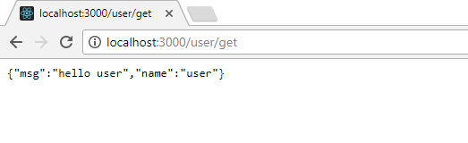
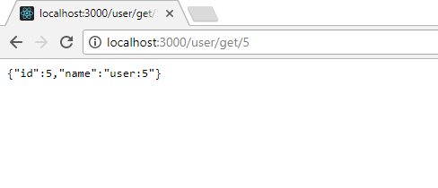
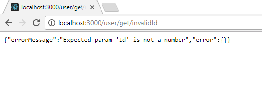

# magic-router

<div align="center">

[](https://travis-ci.org/benhurdavies/magic-router)
[](https://github.com/benhurdavies/magic-router)
[](http://hits.dwyl.io/benhurdavies/benhurdavies/magic-router)

</div>

Simplify the MVC/api applications routing.

### Installation

```javascript
npm install --save magic-router
```

### API Guidelines

All the controllers in the controller folder are loaded and the default routes are configured automatically by the magic-router.

> The default router will be : Hostname/controller(controller filename without extension)/action(method name)

From app.js

```javascript
import express from 'express';
const app = express();
```
....
.....
```javascript 
import magicRouter from 'magic-router';

//adding all contollers..
magicRouter.addAll(app, { dirPath: './controllers' });

```
* Usage [example](./example) 

The developers need to focus only on the controllers.

## How to write a controller

* Controller should be an object.

```javascript
export default {
    // OPTIONAL
    // specifying the router is optional for customizing the router path
    // default will be action name.
  router: {
    // route overrides will come here <methodname>:<route>
    // a route with specific param will look like the one below
    foo1: 'foo/:id',
  },

  // OPTIONAL
  // type is optional for customizing the request type for methods.
  // It can be 'get', 'post' or any verb. 
  // default will be 'use' as in app.use(...
  type: {
    // type overrides will come here  <methodname>:<verb> 
    foo: 'get',   
  },

  // OPTIONAL
  // beforeController is optional for customizing filters or middlewares before request enters
  // controller object.
  beforeController: [
    (req, res, next) => {
      console.log('This will be hit before the control is passed to the controller object.');      
      next();
    },
    ... 
    // multiple middleware can be configured here in the same way.
    // say, authenticate, auditlog etc
  ],

  // OPTIONAL
  // beforeAction is optional for customizing filters or middlewares before request enters
  // current action corresponding to the route
  beforeAction: {
    // <methodname>:[middleware1, middleware2, ...]  
    foo: [print],
  },

  // foo is an action in this controller
  foo(req, res, next) {
    res.send('Foo');
  },

  // foo1 is an action in this controller with a parameter: id
  foo1(req, res, next) {
    res.send('id :' + req.param('id'));
  },
};
```

Everything except the action methods are optional and you need to write 
those only if you need to override the default behaviors.

### Screenshots

* Get user


* Get user with id


* Get user with invalid id - exception handling


### Release version

#### 1.0.7 : Exception handling
* All action methods in controller are exception handled, If any exception caused inside an action, Error will forewarded automatically to (_next(err);_) outside/global (app.js) error hooked methods. The implemented at [example](./example).
* Added [test](./test) for testing the framework.

#### 1.0.6 : Initial release
* Basic structure of routing and it's implementation.
* Feature for adding multiple middileware/methods before route enter into controller. Define the same in _beforeController: [method1,method2,..]_ at controller files/object.
* Feature for adding multiple middileware/methods before route enter into action. Define the same in _beforeAction: {actionName1:[method1,method2,..],...}_ at controller files/object.
* Adding all controller files in an directory for magic-routering.
